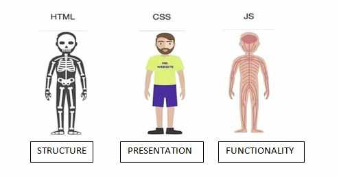
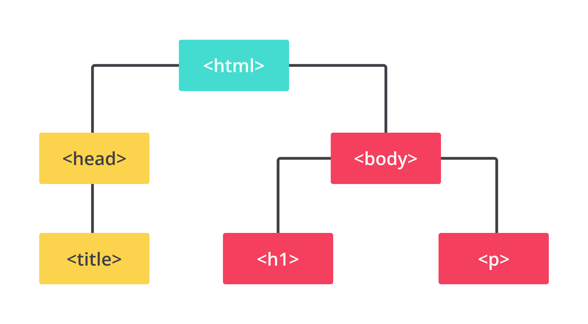

# Pengenalan HTML

## Pondasi Website

- `HTML`: sebuah markup language yang menentukan struktur atau kerangka dari halaman web;

- `CSS`: sebuah declarative language yang memberikan gaya atau styling agar halaman web ditampilkan lebih ciamik; dan

- `JavaScript`: satu-satunya programming language yang didukung oleh browser untuk meningkatkan interaktivitas pada halaman web.

## Analogi Website Terhadap Manusia



Sebagaimana tubuh manusia yang disusun dari kerangka tulang, HTML pada website berperan sebagai kerangka dasar yang digunakan dalam menampilkan visual pada website. Namun, jika hanya sebatas kerangka, manusia tersebut akan terlihat seram dan aneh, bukan? Oleh karena itu, untuk mempercantik sosoknya, kita membutuhkan sebuah kulit, bulu, warna bulu, dsb. Di sinilah peran CSS.

Setelah memiliki kulit dan tampak cantik, selanjutnya kita membutuhkan interaktivitas pada kucing agar dapat bergerak dan berinteraksi. Ibarat dalam kasus ini, JavaScript-lah yang berperan dalam membuat website menjadi dinamis dan interaktif.

## Anatomi Dokumen HTML

```html
<!DOCTYPE html>
<html>
  <head>
    <meta charset="utf-8" />
    <title>Judul Halaman</title>
  </head>
  <body>
    <h1>Heading atau Judul</h1>
    <p>Paragraf</p>
  </body>
</html>
```

### Doctype HTML

- Sederhananya, doctype dimaksudkan sebagai format atau versi HTML dan berisi sekumpulan aturan-aturan yang perlu diikuti dalam membangun halaman web yang baik.

- `<!DOCTYPE HTML PUBLIC "-//W3C//DTD HTML 4.01 Transitional//EN" "http://www.w3.org/TR/html4/loose.dtd">` adalah contoh doctype HTML versi 4.01.
- `<!DOCTYPE html>` adalah doctype HTML versi terbaru yang disebut HTML5.

### Elemen <head>

Elemen <head> berfungsi untuk menyimpan informasi tentang dokumen HTML. Informasi tersebut bisa berupa elemen meta, style, favicon, atau link. Selain itu, elemen ini memungkinkan kita untuk menetapkan judul halaman web yang akan ditampilkan di tab browser. Berikut adalah beberapa contoh elemen yang biasanya ditempatkan dalam elemen <head>.

- <title> 
- <style>
- <base>
- <link>
- <meta>
- <script>
- <noscript>

### Elemen <body>

Setiap konten atau elemen dalam elemen <body> akan ditampilkan dalam halaman web. Elemen <body> biasanya berisi elemen-elemen seperti heading, paragraf, gambar, video, dsb.

### Hierarki Elemen HTML

