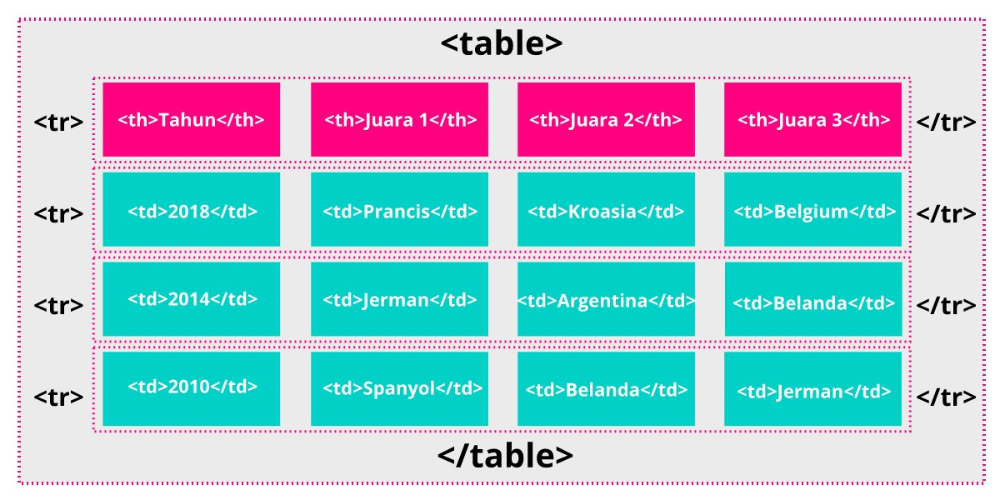

# Table

## Struktur Dasar Tabel

Kode penerapan struktur dasar tabel pada HTML dapat dilihat pada contoh berikut [Contoh Table](<a. Membuat Tabel Pada HTML/Contoh Pembuatan Tabel HTML.html>)

## Spanning Cell

Pada HTML hal ini lebih dikenal sebagai spanning cell, yang artinya menjangkau atau merentangkan sebuah ukuran sel lebih dari ukuran yang biasanya. Dengan spanning cell, kita dapat membuat sebuah tabel yang lebih kompleks, tetapi akan membuat markup yang kita tulis menjadi sedikit sulit dibaca.

### Column Spans

Untuk merentangkan sebuah kolom (column spanning) kita bisa menggunakan atribut colspan pada elemen <td> atau <th>. Berikut adalah contoh untuk penggunaan colspan sehingga sebuah header mencakup dua kolom.

### Row Spans

Untuk merentangkan sebuah baris (row spanning) kita dapat menggunakan atribut rowspan. Mirip seperti column spanning, tetapi atribut ini akan merentangkan sebuah sel ke bawah. Berikut contohnya.

Contoh : [Pembuatan Judul dan Column Spans](<b. Judul Tabel/Elemen Pada Judul Tabel HTML.html>)

## Elemen dan Atribut pada Tabel
Berikut adalah tabel dalam format Markdown:

| Elemen dan Atribut             | Deskripsi                                                                                             |
|-------------------------------|-------------------------------------------------------------------------------------------------------|
| table                          | Menetapkan elemen tabel.                                                                              |
| td                             | Menetapkan sebuah sel dalam baris tabel.                                                              |
| colspan="number"               | Jumlah kolom yang dicakup oleh sel.                                                                   |
| rowspan="number"               | Jumlah baris yang dicakup oleh sel.                                                                   |
| headers="nama header"          | Mengasosiasikan data sel dengan header.                                                               |
| th                             | Menetapkan header yang terkait dengan baris atau kolom.                                               |
| colspan="number"               | Jumlah kolom dicakup oleh header.                                                                     |
| rowspan="number"               | Jumlah row yang dicakup oleh header.                                                                  |
| headers="nama header"          | Mengasosiasikan header dengan header lain.                                                            |
| scope="row\|col\|rowgroup\|colgroup" | Mengasosiasikan header dengan baris, kelompok baris, kolom, atau kelompok kolom.                         |
| tr                             | Menetapkan sebuah baris pada tabel.                                                                   |
| caption                        | Memberikan judul pada sebuah tabel.                                                                   |
| col                            | Menetapkan sebuah kolom.                                                                              |
| colgroup                       | Menetapkan sebuah kelompok kolom.                                                                     |
| tbody                          | Mengidentifikasi sebuah body dalam tabel.                                                             |
| tfoot                          | Mengidentifikasi sebuah footer dalam tabel.                                                           |
| thead                          | Mengidentifikasi sebuah header dalam tabel.                                                           |

Contoh : [Table](<c. Table Formatting/Elemen dan Atribut Table Formatting HTML.html>)