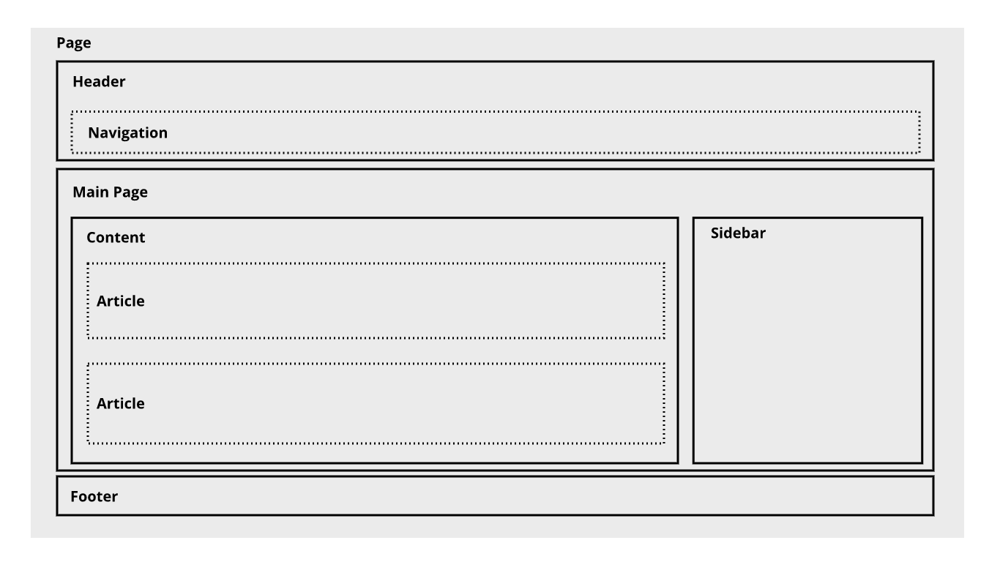
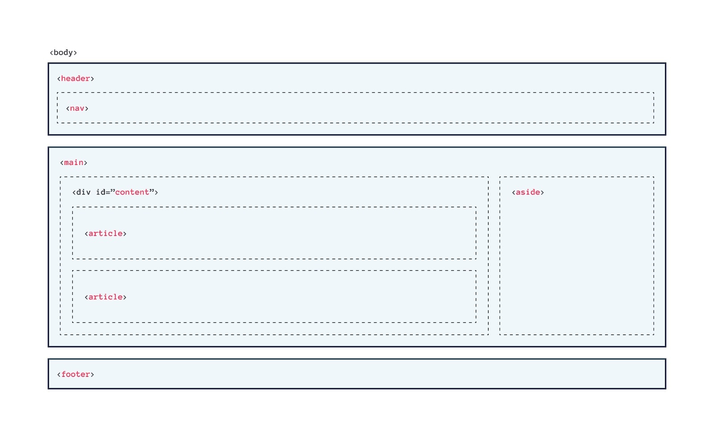

# Semantic HTML: Mengorganisasi Halaman Konten

Sebuah website memiliki hierarki konten yang sama seperti dokumen sehari-hari yang kita baca, majalah, dan koran contohnya. Jadi, hierarki pada sebuah website merupakan hal yang penting. Tentu elemen yang terdapat pada HTML perlu kita kelompokkan menjadi beberapa bagian.

Dalam HTML5, kita dikenalkan pada beberapa elemen yang dapat digunakan untuk mengelompokkan sebuah elemen dengan lebih jelas dan memiliki arti (semantic meaning). Elemen-elemen ini memiliki nama sesuai dengan fungsi atau peran dari elemen tersebut.

## Semantic HTML: Header, Footer, Main, dan Nav

### Header dan Footer
Sebuah header dan footer utama yang muncul pada awal dan akhir di sebuah halaman (`<body>`).

- Header: pengantar atau pembuka konten dalam sebuah elemen `<article>` atau `<section>`. 
- Footer: catatan kaki pada sebuah elemen `<article>` atau `<section>`.

### Main

Element `<main>` digunakan untuk menampung/mewadahi konten utama (dominan) dalam `<body>`. Konten main dapat terdiri dari banyak section, ataupun artikel, atau konten apa pun di dalam elemen main, selama ia termasuk konten utama yang dimiliki oleh website.

### Nav
Elemen `<nav>` digunakan untuk menampung sebuah navigasi yang sifatnya penting (mayor), contohnya navigasi utama pada sebuah website.

## Semantic HTML: Articles, Aside, dan Section

### Articles

Elemen `<article>` bertindak sebagai container untuk independent content pada sebuah halaman, artinya konten utuh yang tidak terkait dengan konten lain, bisa saja sebuah artikel blog, komentar, forum post dan konten lainnya.

### Aside
Elemen` <aside>` memiliki dua tujuan, tergantung kita menempatkannya di dalam sebuah elemen `<article>` atau tidak.

Ketika elemen ini ditempatkan di dalam elemen `<article>`, elemen ini dapat berisi informasi yang berhubungan dengan artikel tersebut, tetapi bukan bagian dari konten artikelnya itu sendiri (dipisahkan dari konten utama). 

Ketika elemen ini ditempatkan di luar elemen `<article>`, elemen ini dapat berisi informasi yang berhubungan dengan halaman secara keseluruhan, seperti sidebar, iklan, atau navigasi.

### Section

Sebuah elemen yang memiliki kesamaan konten dan sebuah heading di dalamnya dapat dikelompokkan dengan menggunakan elemen `<section`>. Dengan begitu elemen ini dapat digunakan pada sebuah elemen `<article>` yang memiliki konten panjang dan berpotensi untuk dikelompokkan.