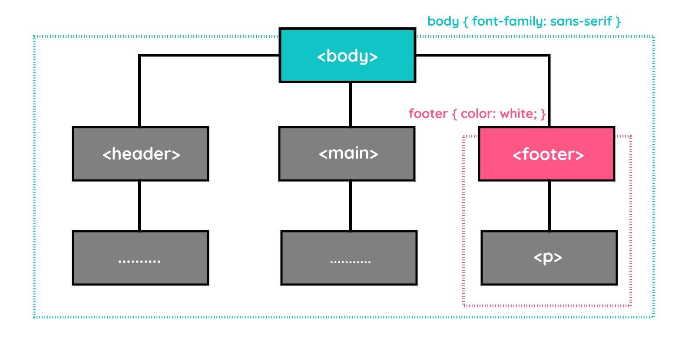

# CSS Conception

Sebelum membahas styling lebih detail, ada beberapa konsepsi dalam CSS yang harus kita pahami.

## Inheritance

Styling HTML bersifat inheritance yang berarti dapat mewarisi properti style “tertentu” dari suatu elemen ke elemen-elemen di dalamnya (child-elements).



## Group Selector

Jika beberapa selector yang berbeda memiliki penerapan properti-propeti yang sama, kita dapat menggabungkannya menggunakan group selector. Hal ini dapat meminimalkan penulisan kode yang berulang.

## Rule Order

Sesuai dengan namanya, cascading artinya “mengalir”. Demikian halnya dengan alur kerja CSS dalam membaca kode, mengalir dari atas ke bawah. Oleh karena itu, kita harus memperhatikan urutan dalam penulisan rules, terutama saat terjadi sebuah konflik. Konflik dapat terjadi karena kita menerapkan beberapa styling pada satu dokumen HTML dan menimpa styling yang telah diterapkan sebelumnya, baik disadari maupun tidak.

Contoh : 

```css 
h1 {
  color: red;
}
```

```html
<h1 style="color: blue;">Hello World</h1>
```

Pada contoh di atas, warna yang akan muncul pada halaman web adalah warna biru, karena warna biru lebih spesifik dibandingkan warna merah.
Untuk menghindari konflik, kita dapat menggunakan !important pada properti yang ingin kita prioritaskan.

```css
h1 {
  color: red !important;
}
```

```html
<h1 style="color: blue;">Hello World</h1>
```

Pada contoh di atas, warna yang akan muncul pada halaman web adalah warna merah, karena kita memberikan prioritas pada warna merah dengan menggunakan !important.

## Selector Dasar: Type Selector, dan Class Selector

Sebenarnya, ada beberapa macam lagi dari  basic selector sebagai berikut.

- Type Selector
- Class Selector
- ID Selector
- Attribute Selector
- Universal Selector

### Type Selector

Type Selector adalah selector yang memilih elemen berdasarkan nama elemen tersebut. Contoh:

```css
h1 {
  color: red;
}
```

### Class Selector

Class Selector adalah selector yang memilih elemen berdasarkan class yang diberikan. Contoh:

```css
.red {
  color: red;
}
```

```html
<h1 class="red">Hello World</h1>
```

### ID Selector

ID Selector adalah selector yang memilih elemen berdasarkan ID yang diberikan. Mirip dengan class, atribut id dapat diterapkan pada seluruh elemen HTML dan kebanyakan atribut ini digunakan untuk memberikan sebuah arti pada generic element, seperti `<div>` dan `<span>`. Namun, atribut id ini tidak bersifat shareable. Artinya, nilai id harus unik dan digunakan pada satu elemen saja.

```html
<!DOCTYPE html>
<html>
  <head>
    <meta charset="UTF-8" />
    <title>Judul Dokumen</title>
    
    <link rel="stylesheet" href="styles.css" />
  </head>
  <body>
    <div id="special">
      <p>Ini merupakan konten di dalam sebuah div yang diberi id special.</p>
    </div>
    <div>
      <p>Ini merupakan konten di dalam sebuah div biasa.</p>
    </div>
  </body>
</html>
```

```css
#special {
  color: red;
}
```

> Hal yang harus ditekankan lagi adalah id ini bersifat unik. Jika ingin menerapkan sebuah rule pada banyak elemen, sebaiknya gunakan atribut class dibandingkan dengan id.

### Attribute Selector

Attribute selector merupakan cara menetapkan target elemen berdasarkan sebuah atribut yang digunakan atau bahkan bisa lebih spesifik dengan nilainya. Contohnya sebagai berikut.

```css
ul {
  font-size: 18px;
}

/* <a> element yang menerapkan href attribute */
a[href] {
  color: blue;
}

/* <a> element yang menerapkan nilai pada href dengan awalan "#" */
a[href^='#'] {
  background-color: red;
}

/* <a> element yang menerapkan nilai pada href yang mengandung teks "example" */
a[href*='example'] {
  background-color: blue;
}

/* <a> element yang menerapkan nilai pada href yang mengandung teks "insensitive" tidak mementingkan huruf kapital*/
a[href*='insensitive' i] {
  color: cyan;
}

/* <a> element yang menerapkan nilai pada href dengan akhiran ".org" */
a[href$='.org'] {
  color: red;
}
```

```html
<!DOCTYPE html>
<html>
  <head>
    <meta charset="UTF-8" />
    <title>Judul Dokumen</title>
    
    <link rel="stylesheet" href="styles.css" />
  </head>
  <body>
    <ul>
      <li><a href="#">Home</a></li>
      <li><a href="https://www.example.com">Example Link</a></li>
      <li><a href="#HalloBST">InSensitive</a></li>
      <li><a href="https://www.example.org/insensitive">Example Org</a></li>
    </ul>
  </body>
</html>
```

Berikut adalah tabel yang merangkum selector CSS berbasis atribut beserta deskripsi masing-masing:

| Selector      | Deskripsi                                                                 |
|---------------|---------------------------------------------------------------------------|
| `[attr]`      | Menargetkan elemen yang menerapkan atribut `attr`.                        |
| `[attr=value]`| Menargetkan elemen yang menerapkan atribut `attr` dengan nilai `value`.   |
| `[attr~=value]`| Menargetkan elemen yang menerapkan atribut `attr` dan salah satu nilainya adalah `value`. |
| `[attr^=value]`| Menargetkan elemen yang menerapkan atribut `attr` dan nilainya diawali dengan `value`. |
| `[attr$=value]`| Menargetkan elemen yang menerapkan atribut `attr` dan nilainya diakhiri dengan `value`. |
| `[attr*=value]`| Menargetkan elemen yang menerapkan atribut `attr` dan nilainya mengandung `value`. |

Tabel ini dapat digunakan sebagai referensi untuk memahami berbagai selector atribut dalam CSS.

### Universal Selector

Universal Selector adalah selector yang memilih semua elemen pada halaman web. Contoh:

```css
/* Seluruh Tipe Elemen */
* {
  color: red;
}

/* Seluruh Elemen yang berada di dalam <div> */
div * {
  color: blue;
}

/* Seluruh Elemen yang berada di dalam <div> yang memiliki class "special" */
div.special * {
  color: green;
}

/* Menargetkan seluruh tipe elemen yang mengandung nilai "en" pada atribut lang */
*[lang~="en"] {
  color: red;
}

/* Menargetkan seluruh tipe elemen yang memiliki nilai "warning" pada atribut class */
*.warning {
  color: red;
}

/* Menargetkan seluruh tipe elemen yang memiliki nilai "content" pada atribut id */
*#content {
  border: 1px solid blue;
  padding: 20px;
}
```

```html
<!DOCTYPE html>
<html>
  <head>
    <meta charset="UTF-8" />
    <title>Judul Dokumen</title>
    
    <link rel="stylesheet" href="styles.css" />
  </head>
  <body>
     <p>
      Ini merupakan paragraf biasa atau tidak menerapkan atribut apapun. Maka
      teks pada paragraf ini akan berwarna hijau
    </p>
    <p lang="en-us">
      This is an English paragraph contains en-us value of lang attribute, so
      this text will be green and italic.
    </p>

    <div class="special">
      <p>Ini merupakan konten di dalam sebuah div yang diberi class special.</p>
    </div>
    <div>
      <p>Ini merupakan konten di dalam sebuah div biasa.</p>
    </div>

     <p class="warning">
      Ini merupakan paragraf yang diberi class warning. Maka teks pada paragraf
      ini akan berwarna merah.
    </p>

    <div id="content">
      <p>
        Ini merupakan sebuah teks di dalam sebuah div yang memiliki id bernilai
        "content", seharusnya paragraf ini dibungkus dalam border yang memiliki
        padding 20px
      </p>
    </div>
  </body>
</html>
```

## Combinators: Adjacent Sibling Selector dan General Sibling Selector

Ada empat kombinator yang dapat kita gunakan, yaitu Adjacent Sibling Selector, General Sibling Selector, Child Selector, dan Descendant Selector.

### Adjacent Sibling Selector `+`

Adjacent Sibling Selector adalah selector yang memilih elemen yang berada tepat setelah elemen lainnya. Contoh:

```css
h1 + p {
  color: red;
}
```

```html
<h1>Heading 1</h1>
<p>Paragraph 1</p>
<p>Paragraph 2</p>
```

> Adjacent Sibling Selector terdiri dari dua buah target elemen, tetapi hanya elemen kedua yang menerapkan rule selama elemen tersebut dituliskan langsung setelah elemen pertama pada berkas HTML. Selain itu, kedua elemen tersebut harus berada dalam induk elemen yang sama

### General Sibling Selector `~`

Mirip seperti Adjacent Sibling Selector, tetapi rules akan diterapkan pada seluruh elemen kedua yang berada setelah elemen pertama selama masih memiliki induk yang sama, walaupun posisi dari elemen kedua tidak berada tepat setelahnya. Contoh:

```css
h1 ~ p {
  color: red;
}
```

```html
<!DOCTYPE html>

<html>
  <head>
    <meta charset="UTF-8" />
    <title>Judul Dokumen</title>
    
    <link rel="stylesheet" href="styles.css" />
  </head>
  <body>
    <h1>Heading 1</h1>
    <p>Paragraph 1</p>
    <div>
      <p>Paragraph ini tidak akan berwarna merah</p>
    </div>
    <p>Paragraph 2</p>
  </body>
</html>
```

### Child Selector (>)

Child Selector adalah selector yang memilih elemen yang berada tepat di bawah elemen lainnya. Contoh:

```css
div > p {
  color: red;
}
```

```html
<!DOCTYPE html>

<html>
  <head>
    <meta charset="UTF-8" />
    <title>Judul Dokumen</title>
    
    <link rel="stylesheet" href="styles.css" />
  </head>
  <body>
    <div>
      <p>Paragraph 1</p>
      <section>
        <p>Paragraph ini tidak akan berwarna merah</p>
      </section>
      <p>Paragraph 2</p>
    </div>
    <p>Paragraph 3</p>
  </body>
</html>
```

### Descendant Selector ( )

Descendant Selector mirip seperti child selector, tetapi hierarkinya lebih luas karena rule akan diterapkan pada seluruh elemen yang menjadi turunannya walaupun secara tidak langsung.

```css
div p {
  color: red;
}
```

```html
<!DOCTYPE html>

<html>
  <head>
    <meta charset="UTF-8" />
    <title>Judul Dokumen</title>
    
    <link rel="stylesheet" href="styles.css" />
  </head>
  <body>
    <div>
      <p>Paragraph 1</p>
      <section>
        <p>Paragraph ini akan berwarna merah</p>
      </section>
      <p>Paragraph 2</p>
    </div>
    <p>Paragraph 3</p>
  </body>
</html>

```
## Pseudo Selector

Pseudo Selector adalah selector yang memilih elemen berdasarkan keadaan atau kondisi tertentu. Pseudo Selector dibagi menjadi dua, yaitu Pseudo Class Selector dan Pseudo Element Selector.

### Pseudo Class Selector

Dengan menggunakan selector ini kita dapat memilih elemen berdasarkan class yang tidak tampak pada dokumen. Kita bisa menetapkan rule hanya ketika sebuah tautan telah dikunjungi (:visited) atau ketika sebuah elemen diarahkan dengan kursor (:hover).

Untuk menggunakan Pseudo Class Selector, kita harus menambahkan tanda titik dua (:) sebelum nama pseudo class selector. Contoh:

```css
a:link {
  color: blue;
}

a:visited {
  color: purple;
}

a:hover {
  color: red;
}

a:active {
  color: green;
}
```

```html
<!DOCTYPE html>
<html>
  <head>
    <meta charset="UTF-8" />
    <title>Judul Dokumen</title>
    
    <link rel="stylesheet" href="styles.css" />
  </head>
  <body>
    <a href="#">Link 1</a>
    <a href="https://www.example.com">Link 2</a>
  </body>
</html>
```

Tidak hanya yang dicontohkan di atas, ada banyak sekali class semu yang menjadi standar [pseudo-classes](https://developer.mozilla.org/en-US/docs/Web/CSS/Pseudo-classes) dalam CSS. Kita bisa melihat indeks standar yang ada pada pseudo-class dalam tautan resmi Mozilla.

### Pseudo Element Selector

Pseudo Element Selector memungkinkan kita untuk memilih dan memanipulasi bagian-bagian tertentu dari elemen. Pseudo Element Selector ditandai dengan dua tanda titik dua (::) sebelum nama pseudo element selector. Contoh:

```css
p::first-line {
  color: red;
}

p::first-letter {
  color: blue;
}
```

```html
<!DOCTYPE html>
<html>
  <head>
    <meta charset="UTF-8" />
    <title>Judul Dokumen</title>
    
    <link rel="stylesheet" href="styles.css" />
  </head>
  <body>
    <p>
      Lorem ipsum dolor sit amet, consectetur adipiscing elit. Sed do eiusmod
      tempor incididunt ut labore et dolore magna aliqua.
    </p>
  </body>
</html>
```

Untuk mengetahui lebih lengkap mengenai berbagai macam pseudo-element, kita dapat melihat artikel [Pseudo-elements](https://developer.mozilla.org/en-US/docs/Web/CSS/Pseudo-elements) yang ditulis oleh MDN.

